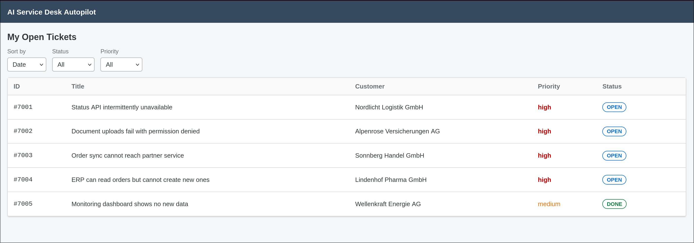
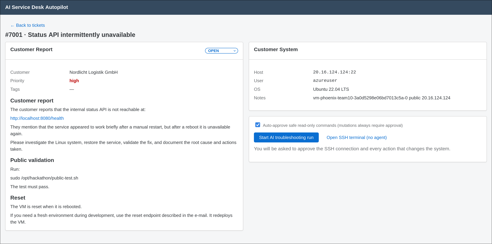
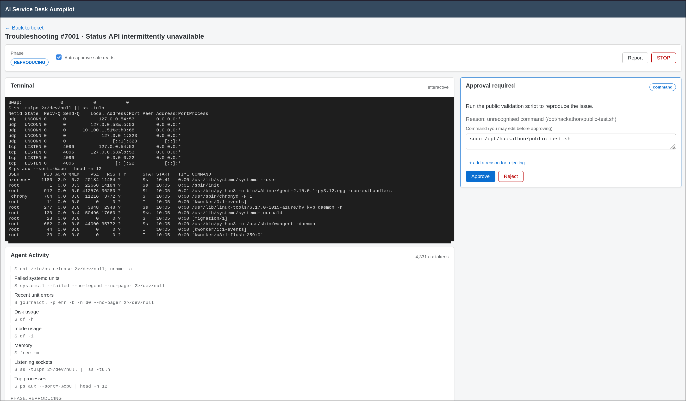

# AI Service Desk Autopilot

An AI-assisted technician workspace for the techbold START Hack track. It pulls
tickets from the Phoenix ERP, connects to a customer Linux VM over SSH, and
diagnoses + fixes the incident **under the technician's control** using a
Cursor-Debug-Mode-style loop, then writes a clean activity back to the ERP.

---

## Look







---

## Setup

Requires Docker and Docker Compose.

```bash
cp .env.example .env
cp /path/to/your-keys.pem keys/case{n}_key.pem   # one key per ticket case
```

### Fill `.env`

Minimum for Builder Base (real Phoenix + SSH):

```bash
PHOENIX_API_BASE_URL=https://your-phoenix-url-from-builder-base
PHOENIX_API_TOKEN=your-team-token
SSH_PRIVATE_KEY_PATH=/keys/case1_key.pem   
OPENROUTER_API_KEY=your-openrouter-key     
```

### SSH keys (`case{N}_key.pem`)

Ticket **700N** uses `keys/caseN_key.pem` (N = ticket id − 7000). Put keys in
`./keys/` (Docker mounts it read-only at `/keys`). `SSH_PRIVATE_KEY_PATH` can
point at any key in that folder — the backend picks the matching sibling per
ticket.

### Run

```bash
docker compose up --build
```

- Frontend: [http://localhost:5173](http://localhost:5173)
- Backend: [http://localhost:8000/health](http://localhost:8000/health)

---

## Workflow

One continuous autonomous agent (tool-calling loop), not a fixed pipeline!:

### Optimized Workflow

```
New Ticket:
-> Start: SSH connection
-> Automatically collect context with a standartised set of commands
-> AI tries to reproduce the issue
-> AI creates different ranked hypotheses
-> Technician picks what hypothesis to verify
-> AI verifies the Hypothesis by investigating
-> If root cause is not correct: create new hypthesis
-> AI proposes fix
-> AI collects proov to validate the fix
-> AI drafts an activity report
-> Technician reworks report and updates the ERP-System
```

### LLM-steering

The agent drives the investigation, but the technician steers at every gate:

- **Hypothesis pick** — after reproducing, the agent presents 2+ ranked root-cause hypotheses; the technician selects one, writes their own, or leaves comments that are feedback as steering guidance
- **Command gate** — state-changing commands pause for approval, the technician can approve, edit, or reject (with an optional reason)
- **Fix review** — `ProposeFix` is presented as one reviewable plan (explanation, commands, validation, rollback), the technician can influence the agent also here
- **Decision pause** — when blocked or uncertain, the agent calls `RequestDecision` and waits for the technician input
- **Activity sign-off** — the agent drafts the ERP activity; the technician reworks it before submit
- **STOP / manual shell** — STOP aborts the run immediately; the technician can also drop into a plain SSH terminal alongside the agent

### Safeguards

- all requests are sorted into the Following categories
  - **Safe Reads** - a whitelist of commands that are recognized as "safe" and autoapproved when "autoapproving safe reads" is on
  - **Deny** — destructive operations (recursive rm, DB drops, firewall off, secret reads) are blacklisted and cannot be run such that even the technician cannot approve it
  - **Confirm** - All other commandshave to be approved by the technician
  - **Redact** - if a command redacting secrets is confirmed nevertheless the redaction feature delets all exposed features

---

## Voice Control

A hands-free co-pilot built on an **ElevenLabs Conversational AI** agent. The
technician can steer the entire run by voice while keeping their eyes on the
terminal — every voice action goes through the **same human-in-the-loop gates
and safety rules** as the UI; voice is just another input, never a bypass.

The agent can:

- **Read run state** — "status" summarises the phase, pending approval/decision, ranked hypotheses, and whether an activity draft is ready
- **Steer hypotheses** — select, comment on, or dictate a brand-new hypothesis
- **Approve / reject** — reads the pending command back and asks for explicit verbal confirmation before approving (safety gate)
- **Answer decision prompts**, toggle auto-approve for safe reads, send a one-shot command (through the normal mutation gate), submit the activity draft, or stop the run
- **Speak up proactively** — the frontend pushes contextual updates so the agent narrates new approvals, decisions, hypotheses, draft-ready, and phase changes without being asked

**Security**: the backend mints a short-lived signed `wss://` URL from
`ELEVENLABS_API_KEY` + `ELEVENLABS_AGENT_ID` — the API key never reaches the
browser. When those vars are unset, voice degrades gracefully and the rest of
the workspace is unaffected.

Full setup (dashboard agent config, client-tool definitions, system prompt) is
in [`docs/voice-agent.md`](./docs/voice-agent.md).

---

## Architecture

```
frontend/          React + Vite — TicketList, Workspace, xterm terminal
backend/app/
  erp/client.py    Phoenix REST client
  ssh/runner.py    asyncssh runner
  safety/rules.py  denylist + mutation gating + redaction
  agent/loop.py    autonomous tool-calling orchestration
  agent/session.py conversation + context compaction
  runs/manager.py  run registry + human-in-the-loop gates
  mock/phoenix.py  offline ERP for dev/tests
```

The LLM is never the security boundary — `safety/rules.py` enforces hard denies
at the tool layer and again at the SSH runner.

---

MIT